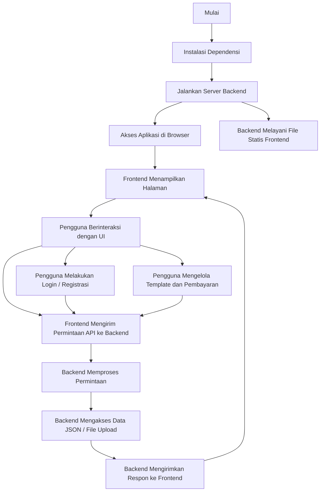

# Diagram Alur Kerja Proyek Template Marketplace

Diagram ini menggambarkan alur utama dari instalasi, menjalankan server, interaksi pengguna dengan frontend, komunikasi antara frontend dan backend, serta pengelolaan data di backend.
